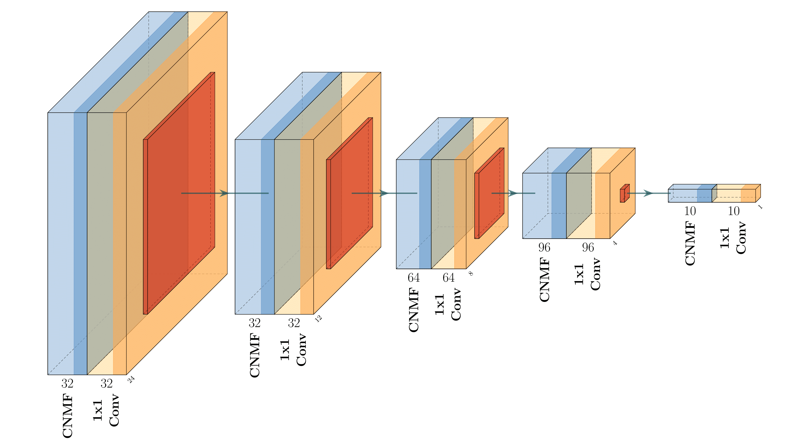
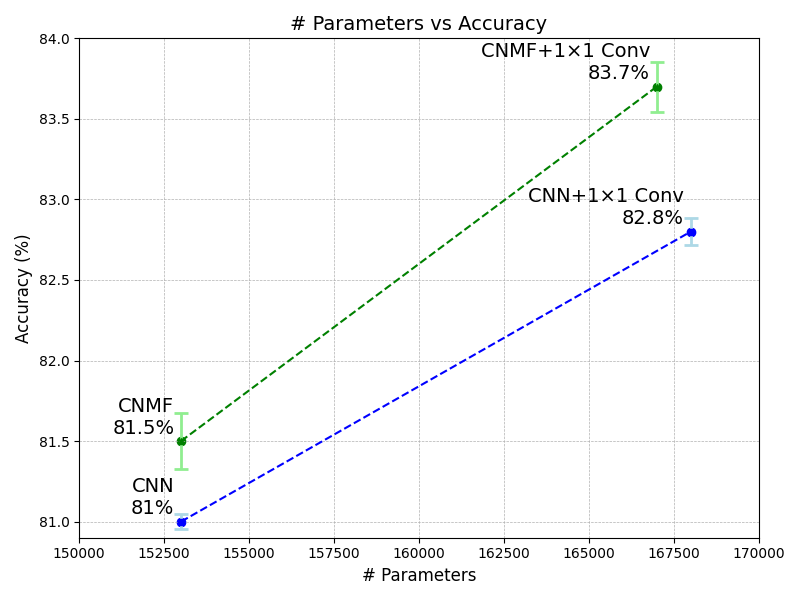

# Deep Non-negative Matrix Factorization Networks

This repository contains the official implementation of the paper **"Including local feature interactions in deep non-negative matrix factorization networks improves performance"**.

## Overview

This project explores biologically inspired neural network architectures that incorporate non-negative matrix factorization (NMF) with local feature interactions. Our research introduces a novel approach that leverages the biological plausibility of NMF while enhancing performance through local mixing operations.

Key contributions:
- A hierarchical NMF architecture where weights are treated as learnable parameters and optimized through backpropagation
- An efficient approximated backpropagation procedure that dramatically reduces memory consumption and computation time
- A novel network architecture that combines convolutional NMF modules with 1×1 convolutional layers to enable local feature interactions

Our approach achieves performance that exceeds traditional CNNs of similar size while maintaining biological constraints such as positive long-range interactions.

## Installation

```bash
# Clone this repository
git clone https://github.com/yourusername/deep-nmf.git
cd deep-nmf

# Install dependencies
pip install -r requirements.txt
```

## Usage

### Training

To train the CNMF+1×1 model on CIFAR-10:

```bash
python run_train.py --model --config-network-filename=configs/networks/cnnmf_1x1cnn.json --log-dir=logs
```


## Approximated Backpropagation


The difference between our approximative approach and the naive backpropagation. Since NMF is an iterative algorithm, the output of each layer is computed after several iterations of the update rule. To apply the conventional backpropagation, all these intermediate steps are required to be saved to the memory during the forward pass, which is time- and memory-inefficient. Instead, our proposed approximated backpropagation can compute the corresponding error of a lower layer in one step, only utilizing the output of the layer.

## Model Architecture



Our proposed architecture consists of five sequential blocks, each containing a CNMF module followed by a 1×1 convolutional layer. The architecture progressively reduces spatial dimensions from 32×32 to 1×1 while transforming feature channels (32→32→64→96→10→output).

## Results

Our CNMF+1×1 model achieves **83.7%** accuracy on CIFAR-10, outperforming both the baseline CNN (81.0%) and standard CNMF (81.5%) models with comparable parameter counts.



<!-- ## Citation

If you find this code useful for your research, please cite our paper:

```bibtex
@article{...,
  title={Including local feature interactions in deep non-negative matrix factorization networks improves performance},
  author={Mahbod Nouri, David Rotermund, Alberto Garcia-Ortiz, Klaus R Pawelzik},
  journal={Journal of LaTeX Templates},
  year={2025}
}
``` -->

## License

This project is licensed under the MIT License - see the [LICENSE](LICENSE) file for details.
